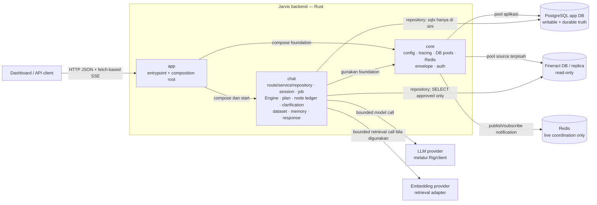

# Overview arsitektur Jarvis

Status: kontrak arsitektur tingkat tinggi untuk backend Jarvis. Dokumen ini merangkum batas komponen dan alur eksekusi yang telah disepakati; detail status, recovery, schema, transaksi, payload, versi teknologi, dan angka operasional tetap dimiliki dokumen rujukannya.

**Sumber kebenaran**: bila dokumen ini bertentangan dengan [database-design.md](../data/database-design.md) atau [engine.md](engine.md), kedua dokumen tersebut menang dan overview ini yang diperbaiki. [PRD](../product/prd.md), [tech-stack](tech-stack.md), [API](../contracts/api.md), dan [SSE](../contracts/sse.md) melengkapi kontrak sesuai bidangnya.

---

## 1. Tujuan dan batas sistem

Jarvis adalah backend Rust untuk asisten analisis data bagi admin Apache Fineract. Jarvis membaca dan menganalisis data melalui capability/query yang telah disetujui, lalu menghasilkan response terstruktur dengan provenance, evidence, dan completeness yang dapat ditelusuri.

- Fineract adalah sumber data **read-only**. Jarvis tidak mengubah record, konfigurasi, maupun schema Fineract dan tidak menjalankan simulasi operasi perbankan.
- PostgreSQL aplikasi adalah sumber kebenaran durable untuk auth/config, session, job, plan, node ledger, klarifikasi, dataset, memori, response, public event, dan audit; lihat inventaris 23 tabel di [database-design.md §3](../data/database-design.md#3-inventaris-tabel).
- Redis hanya mengoordinasikan notifikasi/live SSE. Kehilangan notifikasi tidak boleh menghilangkan progress; state dan replay tetap dibaca dari PostgreSQL ([SSE — Transport and durability](../contracts/sse.md#transport-and-durability)).
- Satu Engine memiliki orchestration end-to-end ([PRD §4](../product/prd.md#4-one-engine)). Rig/LLM client, executor, Tokio, dan petgraph tidak memiliki loop orchestration sendiri.
- Akses data mengikuti `route → service → repository → database`. `sqlx` hanya boleh digunakan di repository, tidak di handler/route atau service.

## 2. Batas komponen

Jumlah crate wajib tetap tiga: `app`, `core`, dan `chat`.



Arah panah menunjukkan dependensi/pemakaian. `chat` boleh bergantung pada fondasi `core`, tetapi **tidak boleh bergantung pada `app`**. `app` adalah composition root yang merakit implementasi dan menjalankan proses; ia bukan tempat business orchestration. Pool PostgreSQL aplikasi dan Fineract terpisah, termasuk credentials dan hak aksesnya ([tech-stack](tech-stack.md#accepted-foundation)).

Di dalam fitur `chat`, batas persistence tetap:

```text
handler/route → service (termasuk Engine) → repository → PostgreSQL/Fineract
```

Handler dan service tidak mengimpor atau memanggil `sqlx`. Query SQL, transaction handle, dan mapping row adalah tanggung jawab repository.

## 3. Kepemilikan runtime

| Komponen | Memiliki | Tidak memiliki |
| --- | --- | --- |
| HTTP handler/route | Authenticate boundary, validasi request transport, accept/read command, envelope HTTP/SSE, lalu delegate | Planning, scheduling, policy, budget, recovery, response composition, query SQL |
| Engine (`chat`) | Context assembly, planning, verification, scheduling/fan-in, policy dan budget guards, recovery, deterministic composition, response assembly/validation, serta koordinasi persistence | SQLx langsung atau loop orchestration yang didelegasikan ke LLM/executor |
| Executor (`chat`) | Satu operasi yang diadmit Engine: approved probe/resolve, curated query, analytical query, atau bounded deterministic composition | Menentukan lifecycle global, menjadwalkan graph, membuat loop agent, memperluas authorization/budget |
| Repository (`chat`/foundation yang dirakit) | Seluruh akses SQLx, transaksi lokal, row mapping, fencing/conditional write sesuai kontrak database | Panggilan LLM/HTTP di dalam transaksi; kebijakan orchestration |
| `core` | Config, tracing, pool PostgreSQL terpisah, Redis integration, HTTP envelope, auth foundation | Fitur reporting dan lifecycle Engine |
| `app` | Entrypoint, wiring dependency, startup/shutdown | Domain reporting atau dependensi yang harus diimpor oleh `chat` |

Dengan demikian handler **hanya accept/read/delegate**. Engine adalah satu-satunya pemilik planning, scheduling, policy, budget, recovery, dan response assembly. LLM melalui Rig hanya melakukan model call yang dibatasi, divalidasi, dan diaudit oleh Engine; ia tidak menjalankan loop orchestration sendiri.

## 4. Alur eksekusi end-to-end

Alur kanonik mengikuti [engine.md — One owner](engine.md#one-owner):

```text
authenticate/validate → persist accepted job → acquire work
→ assemble context → plan/verify → execute ready nodes
→ compose deterministic evidence → assemble/validate response
→ persist response + memory promotion + completion event
```

| Tahap | Pemilik utama | Efek dan batas commit | Panggilan eksternal |
| --- | --- | --- | --- |
| 1. Authenticate/validate | Handler memakai fondasi auth; service memeriksa ownership/command | Validasi boundary dan authorization dilakukan sebelum command diteruskan. Handler tidak menjalankan workflow. | Tidak ada model/source call. Integrasi identitas final tetap mengikuti kontrak security yang kelak disetujui. |
| 2. Persist accepted job | Service/Engine melalui repository | [T1](../data/database-design.md#6-batas-transaksi): idempotency, job `Queued`, user message, `job.accepted`, dan audit commit bersama; HTTP 202 hanya setelah commit. Notifikasi Redis dikirim setelah commit. | **Tidak ada** LLM, HTTP, atau query Fineract di transaksi. |
| 3. Acquire work | Engine worker melalui repository | [T2](../data/database-design.md#6-batas-transaksi): claim lease/fencing dan transisi `Running` commit bersama event serta audit. | Tidak ada model/source call. |
| 4. Assemble context | Engine | Memilih request, scope, memory/session facts, catalog, dan output durable yang relevan serta bounded. Authorization tidak pernah berasal dari summary/memory ([I7](../data/database-design.md#i7--otorisasi-tidak-pernah-dibaca-dari-state-turunan)). | Embedding provider dapat dipanggil melalui retrieval adapter bila retrieval yang disetujui memerlukannya; panggilan dilakukan **di luar** transaksi commit. |
| 5. Plan/verify | Engine; planner/model client dan validator sebagai alat | Engine membatasi model call, memverifikasi graph, contract, authorization, policy, resource budget, dan fan-in. Plan terverifikasi dipersist melalui [T3](../data/database-design.md#6-batas-transaksi). Re-plan selalu berversi dan memakai budget yang sama. | LLM planning dan validasi DB-assisted yang diperlukan berlangsung **di luar** transaksi T3. Static verification mendahului source execution. |
| 6. Execute ready nodes | Engine scheduler mengadmit; executor menjalankan | Hanya node dengan seluruh dependency wajib selesai yang runnable. Hasil/checkpoint node dipersist melalui [T4](../data/database-design.md#6-batas-transaksi) dengan lease token, provenance, completeness, budget, event, dan audit. | Approved query ke Fineract, HTTP provider, atau bounded model call terjadi **di luar** T4. Fineract hanya SELECT melalui curated capability atau analytical contract yang disetujui ([PRD §5](../product/prd.md#5-data-access-modes)). |
| 7. Compose deterministic evidence | Engine mengarahkan executor komposisi | Komposisi Rust/SQL-side yang bounded membentuk evidence dari dataset/output durable; gaps dan truncation tidak boleh disembunyikan. | Tidak memerlukan model call untuk menentukan fakta; bila ada akses data tambahan, ia tetap di luar transaksi commit dan harus diadmit sebagai operasi/node yang disetujui. |
| 8. Assemble/validate response | Engine; model client hanya narasi additive bila dipakai | Engine merakit response terstruktur, menghitung/mengecek completeness dan evidence, lalu menjalankan validasi. Kegagalan narasi tidak boleh menghapus structured output yang valid. | Model call untuk narasi, bila dipakai, berlangsung **di luar** transaksi response commit. |
| 9. Persist response, promote memory, complete | Engine melalui repository | [T7](../data/database-design.md#6-batas-transaksi): response, lifecycle/outcome/completeness terminal, session memory promotion, assistant message, terminal event, dan audit commit bersama. `job.completed` berarti response tervalidasi sudah durable, bukan sudah terkirim ke browser. Summary memori dihitung setelah commit; kegagalannya menandai summary stale tanpa membatalkan response. | Tidak ada panggilan eksternal di T7. Panggilan LLM untuk summary memori hanya **setelah commit**. Redis boleh memberi notifikasi setelah commit; SSE selalu membaca event durable. |

> **I1 — aturan mutlak:** panggilan LLM, HTTP, embedding provider, dan query Fineract **TIDAK PERNAH** berjalan di dalam transaksi commit PostgreSQL aplikasi ([database-design.md I1](../data/database-design.md#i1--tidak-ada-panggilan-eksternal-di-dalam-transaksi-commit)). Transaksi commit hanya memuat operasi PostgreSQL lokal, termasuk audit dan event yang harus atomik dengan state transition.

Klarifikasi tidak membentuk engine kedua: Engine dapat menangguhkan job yang sama ke `WaitingForUser`, menyimpan form/event secara durable, lalu melanjutkan job yang sama setelah jawaban valid. SSE adalah projection progress publik, bukan state machine atau execution path alternatif.

## 5. Data, durability, dan transport

| Batas | Kontrak |
| --- | --- |
| Fineract | Read-only, credentials/pool terpisah, approved surface saja, query terparameterisasi, scope/PII/resource guard, SELECT-only single statement. Bila curated capability dan analytical contract sama-sama tidak mencakup permintaan, hasilnya `Unsupported`; tidak ada fallback ke unrestricted schema. |
| PostgreSQL app DB | Writable dan authoritative untuk seluruh state aplikasi. Perubahan schema hanya lewat `migrations/*.sql`; startup tidak membuat/mengubah tabel. State transition, event publik, dan audit yang terkait commit pada boundary transaksi T1–T12. |
| Redis | Live notification/coordination untuk kerja dan SSE. Bukan job ledger, bukan event history, bukan cursor authority, dan bukan tempat recovery. Outage dipulihkan dengan membaca PostgreSQL dan bounded fallback polling. |
| HTTP | Handler mengembalikan envelope `{ success, data, error }`; 202 berarti durable acceptance. Error publik disanitasi. Lihat [API contract](../contracts/api.md). |
| SSE | Mengirim replay/live event yang sumbernya `job_events` dengan sequence strictly increasing per job ([C14](../data/database-design.md#21-hand-off-yang-ditegakkan-struktur)). Duplicate boleh terjadi; kehilangan koneksi tidak membatalkan job. Lihat [SSE contract](../contracts/sse.md). |

## 6. Acceptance scenarios

1. `OVR-6.1` — **Simple request:** request lengkap tetap melewati satu Engine; job diakui 202 hanya setelah T1, approved source query berjalan read-only di luar transaksi, dan response tervalidasi selesai melalui T7.
2. `OVR-6.2` — **Multi-node fan-in:** node independen dapat berjalan paralel dalam shared budget; node dependen baru diadmit setelah seluruh input wajib selesai. Response menyatakan partial/unknown dan gap secara eksplisit bila fail-policy mengizinkan hasil parsial.
3. `OVR-6.3` — **Clarification dan reconnect:** informasi kurang menangguhkan job yang sama ke `WaitingForUser`; refresh menampilkan form durable yang sama, jawaban valid melanjutkan job, dan replay SSE tidak kehilangan transisi.
4. `OVR-6.4` — **Crash setelah external call:** bila query/model call selesai tetapi T4 belum commit, recovery memperlakukan outcome sebagai uncertain/`Abandoned` dan memakai retry policy bounded; sistem tidak menjanjikan exactly-once external execution.
5. `OVR-6.5` — **Redis outage atau client disconnect:** job tetap berjalan dan state/event tidak hilang; client mengambil snapshot/cursor dari PostgreSQL lalu replay. Disconnect bukan cancel.
6. `OVR-6.6` — **Read-only dan authorization:** upaya memakai surface yang tidak disetujui, memperlebar office scope, atau menulis ke Fineract ditolak sebelum source execution; memory/summary tidak dapat memberikan izin.
7. `OVR-6.7` — **Commit isolation:** instrumentation membuktikan tidak ada LLM, HTTP, embedding, atau query Fineract selama transaksi T1–T12 terbuka; audit/event lokal tetap atomik dengan transisi yang dilindungi.

## 7. Peta kontrak keputusan

| ID/rujukan | Keputusan yang dipakai overview ini |
| --- | --- |
| [I1](../data/database-design.md#i1--tidak-ada-panggilan-eksternal-di-dalam-transaksi-commit) | Tidak ada external call di dalam transaksi commit. |
| [I5](../data/database-design.md#i5--tidak-ada-penghilangan-senyap) | Truncation, expiry, PII off, auto-bind, kurs hilang, dan skip wajib terlihat pada response. |
| [I7](../data/database-design.md#i7--otorisasi-tidak-pernah-dibaca-dari-state-turunan) | Derived memory/summary bukan sumber authorization. |
| [C14](../data/database-design.md#21-hand-off-yang-ditegakkan-struktur) | Event sequence dialokasikan dan di-insert atomik dengan state transition. |
| [C16](../data/database-design.md#21-hand-off-yang-ditegakkan-struktur) | Semua durable worker write menggunakan lease fencing token. |
| [T1–T12](../data/database-design.md#6-batas-transaksi) | Boundary transaksi kanonik aplikasi. |
| [PRD §4](../product/prd.md#4-one-engine) | Satu Engine; executor dan LLM bukan orchestration owner. |
| [PRD §5](../product/prd.md#5-data-access-modes) | Curated capability lebih dahulu, analytical contract bila tercakup, selain itu `Unsupported`. |
